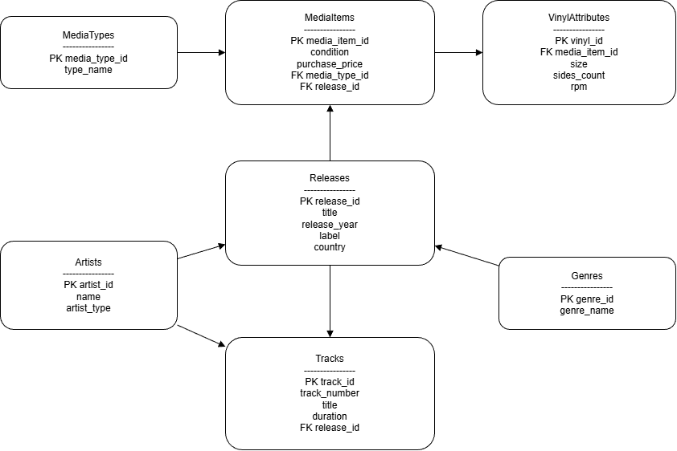

### <p align="center"> Министерство образования, науки и молодежной политики Республики Коми

### <p align="center"> ГПОУ «Сыктывкарский политехнический техникум»

## <p align="center"> Курсовая работа

## <p align="center"> тема: Разработка базы данных для домашней аудиотеки </p>

#### <p align="right"> выполнила

 <p align="right">студентка 4 курса

<p align="right">414 группы

<p align="right">Костина Алёна Владимировна

#### <p align="right">проверил

<p align="right">Пунгин И.В.

<p align="right">дата проверки:

<p align="center">Сыктывкар, 2025 г.

***


## Задание на курсовую работу по МДК 11.01 "Технология разработки и защиты баз данных"

Специальность: <ins> 09.02.07 "Информационные системы и программирование"  </ins>

Тема курсовой работы: Разработка базы данных для домашней аудиотеки

Срок представления работы к защите: <ins> 17 декабря 2025 года. </ins>

Перечень подлежащих разработке вопросов:

1. Анализ предметной области. Постановка задачи.

    1.1. Описание предметной области и функции решаемых задач.

    1.2. Перечень входных данных.

    1.3. Перечень выходных данных

    1.4. Ограничения предметной области (если таковые имеются).

    1.5. Взаимодействие с другими программами.

3. Инфологическая (концептуальная) модель базы данных.

    2.1. Выделение информационных объектов.

    2.2. Определение атрибутов объектов.

    2.3. Определение отношений и мощности отношений между объектами.

    2.4. Построение концептуальной модели.

4. Логическая структура БД.

5. Физическая структура базы данных.

6. Реализация проекта в среде конкретной СУБД.

    5.1. Создание таблиц.

    5.2. Создание запросов.

    5.3. Разработка интерфейса.

    5.4. Назначение прав доступа.

    5.5. Создание индексов.

    5.6. Разработка стратегии резервного копирования базы данных


Руководитель работы __________________ <ins> И. В. Пунгин </ins>

Задание принял к исполнению _______________________________ <ins> А. В. Костина </ins>


## <a id="content">Содержание</a>

1. [Введение](#introduction)
    - [Актуальность темы](#relevance)
    - [Цель работы](#target)
    - [Задачи работы](#tasks)
3. [Основная часть](#main)
    - [Анализ предметной области. Постановка задачи](#analysis)
    - [Инфологическая (концептуальная) модель базы данных](#infological_model)
    - [Логическая структура БД](#logical_structure)
    - [Физическая структура базы данных](#physical_structure)
    - [Реализация проекта в среде конкретной СУБД](#project_realization)
4. [Заключение](#conclusion)
5. [Список использованных информационных источников](#literature)
6. [Приложения](#applications)


## <a id="introduction">Введение</a>

### <a id="relevance">Актуальность темы</a>
На сегодняшний день коллекционеры и меломаны, собирающие физические музыкальные носители (виниловые пластинки, кассеты, CD-диски), сталкиваются с необходимостью систематизации постоянно растущей коллекции. Часто информация о записях хранится фрагментарно: в памяти владельца, на бумажных вкладышах или в разрозненных файлах.

Создание специализированной базы данных, которая соберет всю разрозненную информацию в единую, логически организованную систему, — это практическое решение для современного коллекционера. Она превращает хаотичное собрание пластинок и дисков в структурированный цифровой каталог, сохраняющий как материальную, так и культурную ценность коллекции.

### <a id="target">Цель работы</a>
Проектирование и реализация реляционной базы данных для учета коллекции физических музыкальных носителей «Домашняя аудиотека» с обеспечением целостности данных, учетом специфики различных форматов и предоставлением удобных инструментов для каталогизации и анализа собрания.

### <a id="tasks">Задачи работы</a>
Для достижения поставленной цели необходимо решить следующие задачи:

1.  **Провести анализ предметной области и сформулировать постановку задачи.**
2.  **Разработать концептуальную модель базы данных (ER-диаграмму).**
3.  **Спроектировать логическую и физическую структуру БД.**
4.  **Реализовать проект в среде конкретной СУБД (PostgreSQL 17).**


   ## <a id="main">Основная часть</a>

### <a id="analysis">Анализ предметной области. Постановка задачи.</a>

1. **Описание предметной области и функции решаемых задач**

    1.1 **Предметная область** данной работы — каталогизация и учёт коллекции физических музыкальных носителей в домашних условиях. Система направлена на автоматизацию процессов инвентаризации и анализа собрания аудиозаписей, что позволит коллекционеру систематизировать, отслеживать и оценивать свою коллекцию. Основной целью автоматизации является создание единого цифрового каталога, обеспечивающего удобный доступ к информации, надёжное хранение данных о носителях и возможность глубокого анализа музыкального собрания.

    - **Функции решаемых задач:**
        - **Учёт типов носителей:** Ведение классификации различных форматов аудиозаписей (виниловые пластинки, компакт-кассеты, CD, MiniDisc, SACD, DVD-Audio) с учётом их специфических атрибутов. Это позволит точно описывать физические характеристики каждого экземпляра в коллекции.
        - **Каталогизация музыкальных релизов:** Сохранение полных данных о каждом альбоме, сборнике или сингле, включая название, год издания, лейбл, страну выпуска и каталожный номер. Это обеспечит формирование полной дискографии и истории изданий.
        - **Управление информацией об артистах:** Ведение базы данных исполнителей и музыкальных коллективов с возможностью указания их типа (сольный исполнитель, группа, оркестр) и связи с конкретными релизами и треками.
        - **Детализированный учёт треков:** Запись информации о каждой композиции (название, длительность, порядковый номер в альбоме) с возможностью указания участия конкретных артистов в каждом треке. Это позволит точно документировать авторство и участие музыкантов.
        - **Жанровая классификация:** Систематизация музыкальной коллекции по жанрам с возможностью присвоения нескольких направлений одному релизу для гибкой категоризации.
        - **Учёт состояния и стоимости:** Фиксация физического состояния каждого экземпляра (Новое, хорошее, повреждённое, коллекционное), даты и стоимости приобретения, что важно для оценки и страхования коллекции.
        - **Генерация отчётов и аналитика:** Автоматическое формирование отчётов о составе коллекции (статистика по форматам, жанрам, годам издания), её общей стоимости, состоянии экземпляров и других аналитических данных для принятия informed решений о коллекционировании.

### 2. Перечень входных данных

Для эффективной работы системы «Домашняя аудиотека» необходимы следующие входные данные:

- **Данные о типах носителей:**
    - Идентификатор типа носителя (ID;
    - Название формата (например, «Виниловая пластинка», «Компакт-кассета», «CD»);
    - Описание формата (опционально).

- **Данные о физических экземплярах (носителях):**
    - Идентификатор экземпляра (ID);
    - Идентификатор типа носителя;
    - Состояние (Новое, хорошее, повреждённое, коллекционное).
    - Стоимость приобретения;
    - Дата приобретения;
    - Примечания.

- **Специфичные данные для виниловых пластинок:**
    - Идентификатор экземпляра винила (привязка к основному экземпляру);
    - Формат пластинки (например, 7", 10", 12");
    - Количество сторон (1 или 2).

- **Данные о музыкальных релизах (изданиях):**
    - Идентификатор релиза (ID);
    - Название альбома/сборника/сингла;
    - Год издания (оригинального релиза);
    - Год издания данного тиража (если отличается);
    - Лейбл звукозаписи;
    - Страна издания;
    - Каталожный номер на лейбле;
    - Общее количество треков;
    - Общая длительность (в секундах).

- **Данные об артистах:**
    - Идентификатор артиста (ID);
    - Имя/название (для сольных исполнителей или групп);
    - Тип артиста;
    - Страна происхождения.

- **Данные о треках (композициях):**
    - Идентификатор трека (ID);
    - Идентификатор релиза;
    - Порядковый номер в альбоме;
    - Название трека;
    - Длительность (в секундах).

- **Данные о жанрах:**
    - Идентификатор жанра (ID);
    - Название жанра.

- **Данные о пользователях системы (опционально, для разграничения прав):**
    - Идентификатор пользователя (ID);
    - Логин;
    - Пароль (хэшированный);
    - Роль (например, «Администратор», «Пользователь»).

 ### 3. Перечень выходных данных

На основе входных данных система «Домашняя аудиотека» должна предоставлять следующие выходные данные (отчёты и аналитические выборки):

- **Каталог коллекции:**
    - Полный перечень всех физических носителей в коллекции с указанием основных атрибутов (название релиза, исполнитель, формат, состояние, место хранения);
    - Детализированная карточка отдельного экземпляра со всей связанной информацией (трек-лист, участие артистов, специфичные атрибуты носителя).

- **Статистические отчёты по коллекции:**
    - Распределение коллекции по типам носителей (количество и процентное соотношение виниловых пластинок, кассет, CD и других форматов);
    - Распределение коллекции по музыкальным жанрам;
    - Динамика пополнения коллекции по годам (график/таблица приобретений);
    - Оценка общей стоимости коллекции (суммарная и средняя стоимость по форматам).

- **Аналитические выборки и отчёты:**
    - **Поиск дубликатов:** Выявление одинаковых релизов в разных форматах или нескольких копий одного издания;
    - **Отчёт по исполнителям:** Полная дискография конкретного артиста/группы, имеющаяся в коллекции;
    - **Отчёт по лейблам:** Список релизов, изданных определённым лейблом;
    - **Выборка по критериям:** Гибкий поиск и формирование списков по любому сочетанию параметров 

- **Справочная информация и сводки:**
    - Алфавитный указатель исполнителей, имеющихся в коллекции;
    - Список всех музыкальных жанров, представленных в собрании, с количеством релизов в каждом.

- **Вспомогательные отчёты:**
    - **Список желаний (Wishlist):** Перечень релизов, планируемых к приобретению.
 
 ### 4. Ограничения предметной области

При разработке и эксплуатации базы данных «Домашняя аудиотека» необходимо учитывать следующие ограничения и требования:

- **Ограничения по структуре данных:**
    - **Уникальность каталожных номеров:** Для предотвращения дублирования записей каждый физический носитель должен иметь уникальный идентификатор или каталожный номер в рамках системы;
    - **Валидация специфичных атрибутов:** Для каждого типа носителя должны быть определены допустимые значения атрибутов (например, для винила: размеры 7", 10", 12"; скорости вращения 33, 45, 78 об/мин; количество сторон 1 или 2);
    - **Ограничение связей:** Артист должен быть связан хотя бы с одним релизом или треком. Релиз должен содержать хотя бы один трек. Физический носитель должен быть связан ровно с одним релизом.

- **Ограничения по объёму и производительности:**
    - **Рост коллекции:** Система должна эффективно работать как с небольшими коллекциями (десятки носителей), так и с крупными собраниями (тысячи экземпляров) без значительного снижения скорости выполнения запросов;
    - **Производительность сложных запросов:** Запросы с множественными соединениями таблиц (JOIN) для получения полной информации о релизе (артисты, треки, жанры) должны быть оптимизированы с помощью индексов.

- **Ограничения по безопасности и доступу:**
    - **Конфиденциальность данных:** Информация о стоимости коллекции является конфиденциальной. Необходимо разграничить права доступа, если системой пользуются несколько человек;
    - **Целостность данных:** Должны быть реализованы механизмы поддержания ссылочной целостности (CASCADE, RESTRICT) для предотвращения появления «висячих» ссылок (например, удаление артиста, связанного с релизами).

- **Ограничения по надёжности и обслуживанию:**
    - **Резервное копирование:** Необходима регулярная стратегия бэкапов для предотвращения потери данных в случае сбоя оборудования, ошибок программного обеспечения или действий пользователя;
    - **Миграция и обновление:** Структура базы данных должна позволять относительно безболезненное добавление новых типов носителей или атрибутов в будущем без необходимости полной перестройки системы;
    - **Внешние зависимости:** При использовании графического интерфейса на Python необходимо обеспечить совместимость версий библиотек (psycopg2, Tkinter/PyQt) и их доступность на целевых платформах.

### <a id="infological_model">Инфологическая (концептуальная) модель базы данных</a>

Концептуальная модель базы данных описывает структуру данных, которые хранятся и обрабатываются в системе, без привязки к конкретной системе управления базами данных. Она отражает основные сущности предметной области, их атрибуты и взаимосвязи. Данная модель разрабатывается на основе анализа предметной области и служит основой для последующего логического и физического проектирования базы данных.

### 1. Выделение информационных объектов (сущностей)

В процессе анализа предметной области «Домашняя аудиотека» были выделены следующие основные сущности:

*   **Типы носителей (MediaTypes)** — справочник форматов физических носителей, используемых в домашней аудиотеке (виниловая пластинка, компакт-кассета, CD, MiniDisc и др.).
*   **Физические экземпляры (MediaItems)** — конкретные материальные носители, находящиеся в коллекции владельца (отдельные пластинки, кассеты, диски).
*   **Атрибуты винила (VinylAttributes)** — специализированные характеристики, применимые только к виниловым пластинкам (размер, количество сторон).
*   **Музыкальные релизы (Releases)** — логические музыкальные издания (альбомы, сборники), независимые от формы физического носителя.
*   **Артисты (Artists)** — исполнители, музыкальные коллективы и другие участники создания музыкального контента.
*   **Треки (Tracks)** — отдельные музыкальные композиции, входящие в состав релизов.
*   **Жанры (Genres)** — справочник музыкальных направлений и стилей.

**Примечание:** Сущность «Пользователи системы» в рамках данной курсовой работы не рассматривается, так как база данных предназначена для ведения персональной домашней коллекции и не предполагает многопользовательский режим работы.

### 2. Определение атрибутов объектов

*   **Типы носителей (MediaTypes):**
    *   `media_type_id` — уникальный идентификатор типа носителя.
    *   `type_name` — наименование формата носителя.
    *   `description` — описание формата (опционально).

*   **Физические экземпляры (MediaItems):**
    *   `media_item_id` — уникальный идентификатор физического экземпляра.
    *   `catalog_number` — каталожный номер или штрих-код.
    *   `media_type_id` — идентификатор типа носителя (внешний ключ).
    *   `release_id` — идентификатор музыкального релиза (внешний ключ).
    *   `condition` — состояние экземпляра (например, 'Mint', 'Very Good').
    *   `purchase_price` — стоимость приобретения.
    *   `purchase_date` — дата приобретения.
    *   `storage_location` — место хранения.
    *   `notes` — примечания (опционально).

*   **Атрибуты винила (VinylAttributes):**
    *   `vinyl_id` — уникальный идентификатор записи.
    *   `media_item_id` — ссылка на физический экземпляр виниловой пластинки (внешний ключ).
    *   `size` — размер пластинки (например, '7"', '12"').
    *   `sides_count` — количество сторон (1 или 2).
    *   `rpm` — скорость вращения (33, 45, 78 об/мин).

**Примечание:** Данная сущность является специализированной и используется только для экземпляров типа «виниловая пластинка».

*   **Музыкальные релизы (Releases):**
    *   `release_id` — уникальный идентификатор релиза.
    *   `title` — название релиза (альбома, сборника).
    *   `release_year` — год издания данного тиража.
    *   `original_year` — год оригинального релиза.
    *   `label` — звукозаписывающий лейбл.
    *   `country` — страна издания.
    *   `catalog_code` — каталожный номер на лейбле.
    *   `total_duration` — общая длительность в секундах.

*   **Артисты (Artists):**
    *   `artist_id` — уникальный идентификатор артиста.
    *   `name` — имя или название артиста/группы.
    *   `artist_type` — тип артиста (например, 'Solo', 'Band').
    *   `country` — страна происхождения (опционально).

*   **Треки (Tracks):**
    *   `track_id` — уникальный идентификатор трека.
    *   `release_id` — идентификатор релиза (внешний ключ).
    *   `track_number` — порядковый номер трека в релизе.
    *   `title` — название трека.
    *   `duration` — длительность композиции в секундах.
    *   `side` — обозначение стороны носителя (для винила/кассет).

*   **Жанры (Genres):**
    *   `genre_id` — уникальный идентификатор жанра.
    *   `genre_name` — наименование жанра (например, 'Rock', 'Jazz').

### 3. Определение отношений и их мощности

В разработанной концептуальной модели определены следующие связи между сущностями:

| Связь между сущностями | Тип связи | Описание |
| :--- | :--- | :--- |
| **Типы носителей — Физические экземпляры** | **Один ко многим (1:М)** | Один тип носителя может соответствовать нескольким физическим экземплярам. Каждый физический экземпляр относится только к одному типу носителя. |
| **Физические экземпляры — Атрибуты винила** | **Один к одному (1:1) – условная** | Физический экземпляр, являющийся виниловой пластинкой, может иметь один набор специфических атрибутов. Для других типов носителей данная связь отсутствует. |
| **Музыкальные релизы — Физические экземпляры** | **Один ко многим (1:М)** | Один музыкальный релиз может быть представлен несколькими физическими экземплярами различных форматов и годов издания. Каждый экземпляр связан с одним релизом. |
| **Музыкальные релизы — Треки** | **Один ко многим (1:М)** | Каждый музыкальный релиз включает в себя несколько треков. Каждый трек принадлежит только одному релизу. |
| **Музыкальные релизы — Артисты** | **Многие ко многим (М:М)** | В создании одного релиза могут участвовать несколько артистов, и один артист может участвовать в создании нескольких релизов. Связь реализуется с помощью промежуточной сущности (например, `ReleaseArtists`). |
| **Треки — Артисты** | **Многие ко многим (М:М)** | В записи одного трека могут участвовать несколько артистов, при этом каждый артист может участвовать в записи множества треков. Связь реализуется через промежуточную сущность (например, `TrackArtists`). |
| **Музыкальные релизы — Жанры** | **Многие ко многим (М:М)** | Один музыкальный релиз может относиться к нескольким жанрам, а каждый жанр может быть связан с несколькими релизами. Связь реализуется через промежуточную сущность (например, `ReleaseGenres`). |

4. **Построение концептуальной модели.** На основе выделенных сущностей, их атрибутов и связей между ними можно построить концептуальную ER-диаграмму для базы данных, предназначенной для домашней аудиотеки.



#### <a id="logical_structure">Логическая структура базы данных</a>

Логическая структура базы данных представляет собой детализированное описание таблиц, их атрибутов, типов данных, а также ключевых ограничений и правил целостности. На основе концептуальной модели разработана логическая структура, которая готова для реализации в системе управления базами данных PostgreSQL 17.

В соответствии с предметной областью домашней аудиотеки определены следующие таблицы: **Типы носителей (MediaTypes)**, **Жанры (Genres)**, **Музыкальные релизы (Releases)**, **Артисты (Artists)**, **Треки (Tracks)**, **Физические экземпляры (MediaItems)**, **Атрибуты винила (VinylAttributes)**, а также таблицы связей **ReleaseArtists**, **TrackArtists** и **ReleaseGenres** для реализации отношений «многие ко многим».

#### Определение таблиц и их атрибутов

1. **Таблица "Типы носителей (MediaTypes)"**
    - **media_type_id** (Primary Key) - уникальный идентификатор типа носителя (целое число).
    - **type_name** - название формата носителя (строка).
    - **description** - описание формата (текст).

    **Типы данных:**
    - media_type_id - SERIAL.
    - type_name - VARCHAR(50).
    - description - TEXT.

    **Ограничения:**
    - media_type_id является уникальным и не может быть NULL.
    - type_name является уникальным и не может быть NULL.

2. **Таблица "Жанры (Genres)"**
    - **genre_id** (Primary Key) - уникальный идентификатор жанра (целое число).
    - **genre_name** - наименование жанра (строка).

    **Типы данных:**
    - genre_id - SERIAL.
    - genre_name - VARCHAR(50).

    **Ограничения:**
    - genre_id является уникальным и не может быть NULL.
    - genre_name является уникальным и не может быть NULL.

3. **Таблица "Музыкальные релизы (Releases)"**
    - **release_id** (Primary Key) - уникальный идентификатор релиза (целое число).
    - **title** - название релиза (альбома, сборника) (строка).
    - **release_year** - год издания данного тиража (целое число).
    - **original_year** - год оригинального релиза (целое число).
    - **label** - звукозаписывающий лейбл (строка).
    - **country** - страна издания (строка).
    - **catalog_code** - каталожный номер на лейбле (строка).
    - **total_duration** - общая длительность в секундах (целое число).
    - **total_tracks** - общее количество треков (целое число).

    **Типы данных:**
    - release_id - SERIAL.
    - title - VARCHAR(255).
    - release_year - INTEGER.
    - original_year - INTEGER.
    - label - VARCHAR(100).
    - country - VARCHAR(50).
    - catalog_code - VARCHAR(50).
    - total_duration - INTEGER.
    - total_tracks - INTEGER.

    **Ограничения:**
    - release_id является уникальным и не может быть NULL.
    - title не может быть NULL.
    - release_year и original_year должны быть в диапазоне от 1900 до текущего года + 1.
    - original_year не может быть больше release_year.

4. **Таблица "Артисты (Artists)"**
    - **artist_id** (Primary Key) - уникальный идентификатор артиста (целое число).
    - **name** - имя или название артиста/группы (строка).
    - **artist_type** - тип артиста (строка).
    - **country** - страна происхождения (строка).

    **Типы данных:**
    - artist_id - SERIAL.
    - name - VARCHAR(255).
    - artist_type - VARCHAR(20).
    - country - VARCHAR(50).

    **Ограничения:**
    - artist_id является уникальным и не может быть NULL.
    - name является уникальным и не может быть NULL.

5. **Таблица "Треки (Tracks)"**
    - **track_id** (Primary Key) - уникальный идентификатор трека (целое число).
    - **release_id** (Foreign Key) - ссылка на таблицу **Музыкальные релизы** (целое число).
    - **track_number** - порядковый номер трека в релизе (целое число).
    - **title** - название трека (строка).
    - **duration** - длительность композиции в секундах (целое число).
    - **side** - обозначение стороны носителя (для винила/кассет) (строка).

    **Типы данных:**
    - track_id - SERIAL.
    - release_id - INTEGER.
    - track_number - INTEGER.
    - title - VARCHAR(255).
    - duration - INTEGER.
    - side - VARCHAR(10).

    **Ограничения:**
    - track_id является уникальным и не может быть NULL.
    - release_id является внешним ключом, который ссылается на таблицу **Музыкальные релизы**.
    - track_number должен быть больше 0.
    - комбинация release_id и track_number должна быть уникальной.

6. **Таблица "Физические экземпляры (MediaItems)"**
    - **media_item_id** (Primary Key) - уникальный идентификатор физического экземпляра (целое число).
    - **catalog_number** - каталожный номер или штрих-код (строка).
    - **media_type_id** (Foreign Key) - ссылка на таблицу **Типы носителей** (целое число).
    - **release_id** (Foreign Key) - ссылка на таблицу **Музыкальные релизы** (целое число).
    - **condition** - состояние экземпляра (строка).
    - **purchase_price** - стоимость приобретения в рублях (число с плавающей точкой).
    - **purchase_date** - дата приобретения (дата).
    - **storage_location** - место хранения (строка).
    - **notes** - примечания (текст).

    **Типы данных:**
    - media_item_id - SERIAL.
    - catalog_number - VARCHAR(100).
    - media_type_id - INTEGER.
    - release_id - INTEGER.
    - condition - VARCHAR(30).
    - purchase_price - NUMERIC(10, 2).
    - purchase_date - DATE.
    - storage_location - VARCHAR(255).
    - notes - TEXT.

    **Ограничения:**
    - media_item_id является уникальным и не может быть NULL.
    - catalog_number является уникальным.
    - media_type_id является внешним ключом, который ссылается на таблицу **Типы носителей**.
    - release_id является внешним ключом, который ссылается на таблицу **Музыкальные релизы**.
    - purchase_price должен быть положительным числом или NULL.

7. **Таблица "Атрибуты винила (VinylAttributes)"**
    - **vinyl_id** (Primary Key) - уникальный идентификатор записи (целое число).
    - **media_item_id** (Foreign Key) - ссылка на таблицу **Физические экземпляры** (целое число).
    - **size** - размер пластинки (строка).
    - **sides_count** - количество сторон (целое число).
    - **rpm** - скорость вращения (целое число).

    **Типы данных:**
    - vinyl_id - SERIAL.
    - media_item_id - INTEGER.
    - size - VARCHAR(10).
    - sides_count - INTEGER.
    - rpm - INTEGER.

    **Ограничения:**
    - vinyl_id является уникальным и не может быть NULL.
    - media_item_id является внешним ключом, который ссылается на таблицу **Физические экземпляры** и должен быть уникальным.
    - size должен принимать значения: '7"', '10"', '12"'.
    - sides_count должен быть 1 или 2.
    - rpm должен быть 33, 45 или 78.

8. **Таблица "Связь релизов и артистов (ReleaseArtists)"**
    - **release_id** (Foreign Key) - ссылка на таблицу **Музыкальные релизы** (целое число).
    - **artist_id** (Foreign Key) - ссылка на таблицу **Артисты** (целое число).

    **Типы данных:**
    - release_id - INTEGER.
    - artist_id - INTEGER.

    **Ограничения:**
    - release_id и artist_id вместе образуют составной первичный ключ и не могут быть NULL.

9. **Таблица "Связь треков и артистов (TrackArtists)"**
    - **track_id** (Foreign Key) - ссылка на таблицу **Треки** (целое число).
    - **artist_id** (Foreign Key) - ссылка на таблицу **Артисты** (целое число).

    **Типы данных:**
    - track_id - INTEGER.
    - artist_id - INTEGER.

    **Ограничения:**
    - track_id и artist_id вместе образуют составной первичный ключ и не могут быть NULL.

10. **Таблица "Связь релизов и жанров (ReleaseGenres)"**
    - **release_id** (Foreign Key) - ссылка на таблицу **Музыкальные релизы** (целое число).
    - **genre_id** (Foreign Key) - ссылка на таблицу **Жанры** (целое число).

    **Типы данных:**
    - release_id - INTEGER.
    - genre_id - INTEGER.

    **Ограничения:**
    - release_id и genre_id вместе образуют составной первичный ключ и не могут быть NULL.

          
**Нормализация базы данных**

На данном этапе структура базы данных для домашней аудиотеки приведена к третьей нормальной форме (3NF), что позволяет:

- Устранить избыточность данных за счет разделения информации о музыкальных релизах, артистах, жанрах и физических носителях.
- Избежать аномалий при добавлении (например, дублирования данных об артистах), изменении (непротиворечивое обновление информации) и удалении (сохранение целостности связанных данных).
- Обеспечить эффективное использование памяти и оптимизацию запросов за счет правильной организации связей между сущностями.

Нормализация обеспечивает, что каждый неключевой атрибут зависит только от первичного ключа своей таблицы, что минимизирует дублирование данных и повышает целостность информации в системе учета музыкальной коллекции.

## <a id="physical_structure">Физическая структура базы данных</a>

Физическая структура базы данных определяет способы хранения и организации данных на физическом уровне в выбранной СУБД PostgreSQL 17. Этот этап проектирования обеспечивает целостность, доступность и производительность системы при работе с данными домашней аудиотеки. Важно учитывать оптимизацию запросов, объемы данных (от десятков до тысяч экземпляров в коллекции) и специфику хранения музыкальной информации.

Физическая структура спроектирована таким образом, чтобы система эффективно обрабатывала данные, предоставляя владельцу коллекции быстрый доступ к информации о релизах, артистах, треках и физических носителях. Это достигается за счет выбора оптимальных типов данных, создания индексов для часто используемых полей, настройки ограничений целостности и использования механизмов PostgreSQL для обеспечения надежности хранения.

1. **Выбор типов данных**

Правильный выбор типов данных для полей таблиц является критически важным аспектом проектирования физической структуры базы данных, так как это напрямую влияет на эффективность использования ресурсов, производительность запросов и точность хранения информации.

**Рассмотрим выбор типов данных для каждой таблицы:**

- **SERIAL** — используется для автоинкрементных первичных ключей (media_type_id, genre_id, release_id, artist_id и др.). Этот тип обеспечивает автоматическую генерацию уникальных идентификаторов, что упрощает вставку новых записей и поддерживает целостность связей между таблицами.

- **INTEGER** — применяется для числовых значений с относительно небольшим диапазоном: годы издания (release_year, original_year), количество треков (total_tracks), порядковые номера (track_number), длительность в секундах (duration, total_duration). Занимает 4 байта и обеспечивает эффективное сравнение и индексирование.

- **NUMERIC(10, 2)** — выбран для хранения стоимости приобретения (purchase_price) в рублях с точностью до копеек. Тип NUMERIC гарантирует точное хранение десятичных значений без ошибок округления, что важно для учета финансовых данных коллекции. Параметры (10, 2) позволяют хранить суммы до 10 миллионов рублей.

- **VARCHAR(n)** — используется для текстовых данных переменной длины: названий (title), имен (name), лейблов (label), каталожных номеров (catalog_code). Длина ограничена в соответствии с ожидаемым максимальным размером данных, что экономит пространство хранения по сравнению с типом TEXT.

- **TEXT** — применяется для полей с неограниченным или большим объемом текста: описаний (description), примечаний (notes). Подходит для хранения произвольных текстовых данных без строгих ограничений по длине.

- **DATE** — используется для хранения дат приобретения (purchase_date). Обеспечивает корректное хранение, сравнение и выполнение операций с датами, что важно для анализа динамики пополнения коллекции.

Выбор типов данных основан на анализе предметной области: для цен используется точный десятичный тип, для идентификаторов — целочисленные с автоинкрементом, для текстовых данных — строковые типы соответствующей длины. Это обеспечивает баланс между точностью хранения информации, эффективностью использования дискового пространства и производительностью выполнения запросов.

## <a id="project_realization">Реализация проекта в среде конкретной СУБД</a>

### 5.1. Создание таблиц

Реализация физической структуры базы данных выполнена в СУБД PostgreSQL 17 с использованием pgAdmin 4 как графического клиента для управления. Ниже представлен SQL-скрипт для создания всех необходимых таблиц с соблюдением всех ограничений целостности:

```sql
-- Создание таблицы "Типы носителей"
CREATE TABLE media_types (
    media_type_id SERIAL PRIMARY KEY,
    type_name VARCHAR(50) NOT NULL UNIQUE,
    description TEXT
);

-- Создание таблицы "Жанры"
CREATE TABLE genres (
    genre_id SERIAL PRIMARY KEY,
    genre_name VARCHAR(50) NOT NULL UNIQUE
);

-- Создание таблицы "Музыкальные релизы"
CREATE TABLE releases (
    release_id SERIAL PRIMARY KEY,
    title VARCHAR(255) NOT NULL,
    release_year INTEGER,
    original_year INTEGER,
    label VARCHAR(100),
    country VARCHAR(50),
    catalog_code VARCHAR(50),
    total_duration INTEGER,
    total_tracks INTEGER,
    
    CONSTRAINT check_years 
        CHECK (release_year IS NULL OR (release_year >= 1900 AND release_year <= EXTRACT(YEAR FROM CURRENT_DATE) + 1)),
    CONSTRAINT check_original_year 
        CHECK (original_year IS NULL OR (original_year >= 1900 AND original_year <= EXTRACT(YEAR FROM CURRENT_DATE) + 1))
);

-- Создание таблицы "Артисты"
CREATE TABLE artists (
    artist_id SERIAL PRIMARY KEY,
    name VARCHAR(255) NOT NULL UNIQUE,
    artist_type VARCHAR(20),
    country VARCHAR(50)
);

-- Создание таблицы "Треки"
CREATE TABLE tracks (
    track_id SERIAL PRIMARY KEY,
    release_id INTEGER NOT NULL,
    track_number INTEGER NOT NULL,
    title VARCHAR(255) NOT NULL,
    duration INTEGER,
    side VARCHAR(10),
    
    CONSTRAINT check_track_number 
        CHECK (track_number > 0),
    
    FOREIGN KEY (release_id) 
        REFERENCES releases(release_id) 
        ON DELETE CASCADE,
    
    CONSTRAINT unique_track_in_release 
        UNIQUE (release_id, track_number)
);

-- Создание таблицы "Физические экземпляры"
CREATE TABLE media_items (
    media_item_id SERIAL PRIMARY KEY,
    catalog_number VARCHAR(100) UNIQUE,
    media_type_id INTEGER NOT NULL,
    release_id INTEGER NOT NULL,
    condition VARCHAR(30),
    purchase_price NUMERIC(10, 2),
    purchase_date DATE,
    storage_location VARCHAR(255),
    notes TEXT,
    
    FOREIGN KEY (media_type_id) 
        REFERENCES media_types(media_type_id) 
        ON DELETE RESTRICT,
    
    FOREIGN KEY (release_id) 
        REFERENCES releases(release_id) 
        ON DELETE CASCADE
);

-- Создание таблицы "Атрибуты винила"
CREATE TABLE vinyl_attributes (
    vinyl_id SERIAL PRIMARY KEY,
    media_item_id INTEGER NOT NULL,
    size VARCHAR(10),
    sides_count INTEGER,
    rpm INTEGER,
    
    FOREIGN KEY (media_item_id) 
        REFERENCES media_items(media_item_id) 
        ON DELETE CASCADE,
    
    CONSTRAINT unique_vinyl_item 
        UNIQUE (media_item_id)
);

-- Создание таблицы "Связь релизов и артистов"
CREATE TABLE release_artists (
    release_id INTEGER NOT NULL,
    artist_id INTEGER NOT NULL,
    
    PRIMARY KEY (release_id, artist_id),
    
    FOREIGN KEY (release_id) 
        REFERENCES releases(release_id) 
        ON DELETE CASCADE,
    
    FOREIGN KEY (artist_id) 
        REFERENCES artists(artist_id) 
        ON DELETE CASCADE
);

-- Создание таблицы "Связь треков и артистов"
CREATE TABLE track_artists (
    track_id INTEGER NOT NULL,
    artist_id INTEGER NOT NULL,
    
    PRIMARY KEY (track_id, artist_id),
    
    FOREIGN KEY (track_id) 
        REFERENCES tracks(track_id) 
        ON DELETE CASCADE,
    
    FOREIGN KEY (artist_id) 
        REFERENCES artists(artist_id) 
        ON DELETE CASCADE
);

-- Создание таблицы "Связь релизов и жанров"
CREATE TABLE release_genres (
    release_id INTEGER NOT NULL,
    genre_id INTEGER NOT NULL,
    
    PRIMARY KEY (release_id, genre_id),
    
    FOREIGN KEY (release_id) 
        REFERENCES releases(release_id) 
        ON DELETE CASCADE,
    
    FOREIGN KEY (genre_id) 
        REFERENCES genres(genre_id) 
        ON DELETE CASCADE
);
```

### 5.2. Создание запросов

Для работы с базой данных домашней аудиотеки разработаны следующие типовые запросы:

#### Запрос 1: Полный каталог коллекции с ценами в рублях
```sql
SELECT 
    mi.catalog_number AS "Каталожный номер",
    r.title AS "Название альбома",
    a.name AS "Исполнитель",
    mt.type_name AS "Формат",
    mi.condition AS "Состояние",
    mi.purchase_price || ' ₽' AS "Цена (руб)",
    TO_CHAR(mi.purchase_date, 'DD.MM.YYYY') AS "Дата покупки",
    mi.storage_location AS "Место хранения",
    STRING_AGG(DISTINCT g.genre_name, ', ') AS "Жанры"
FROM media_items mi
JOIN releases r ON mi.release_id = r.release_id
JOIN media_types mt ON mi.media_type_id = mt.media_type_id
LEFT JOIN release_artists ra ON r.release_id = ra.release_id
LEFT JOIN artists a ON ra.artist_id = a.artist_id
LEFT JOIN release_genres rg ON r.release_id = rg.release_id
LEFT JOIN genres g ON rg.genre_id = g.genre_id
GROUP BY mi.catalog_number, r.title, a.name, mt.type_name, mi.condition, 
         mi.purchase_price, mi.purchase_date, mi.storage_location
ORDER BY r.title;
```

#### Запрос 2: Статистика коллекции по форматам
```sql
SELECT 
    mt.type_name AS "Формат носителя",
    COUNT(*) AS "Количество",
    SUM(mi.purchase_price) || ' ₽' AS "Общая стоимость",
    ROUND(AVG(mi.purchase_price), 2) || ' ₽' AS "Средняя цена",
    MIN(mi.purchase_date) AS "Первая покупка",
    MAX(mi.purchase_date) AS "Последняя покупка"
FROM media_items mi
JOIN media_types mt ON mi.media_type_id = mt.media_type_id
GROUP BY mt.type_name
ORDER BY COUNT(*) DESC;
```

#### Запрос 3: Поиск релизов по исполнителю
```sql
SELECT 
    r.title AS "Альбом",
    r.release_year AS "Год издания",
    r.label AS "Лейбл",
    mt.type_name AS "Формат",
    mi.condition AS "Состояние",
    mi.purchase_price || ' ₽' AS "Цена"
FROM media_items mi
JOIN releases r ON mi.release_id = r.release_id
JOIN media_types mt ON mi.media_type_id = mt.media_type_id
JOIN release_artists ra ON r.release_id = ra.release_id
JOIN artists a ON ra.artist_id = a.artist_id
WHERE a.name = 'Кино'
ORDER BY r.release_year;
```

#### Запрос 4: Отчет о виниловых пластинках с деталями
```sql
SELECT 
    r.title AS "Альбом",
    a.name AS "Исполнитель",
    mi.catalog_number AS "Каталожный номер",
    va.size AS "Размер",
    va.sides_count AS "Стороны",
    va.rpm AS "Скорость (об/мин)",
    mi.condition AS "Состояние",
    mi.purchase_price || ' ₽' AS "Цена"
FROM vinyl_attributes va
JOIN media_items mi ON va.media_item_id = mi.media_item_id
JOIN releases r ON mi.release_id = r.release_id
JOIN media_types mt ON mi.media_type_id = mt.media_type_id
LEFT JOIN release_artists ra ON r.release_id = ra.release_id
LEFT JOIN artists a ON ra.artist_id = a.artist_id
WHERE mt.type_name = 'Виниловая пластинка'
ORDER BY r.title;
```

#### Запрос 5: Анализ стоимости коллекции по годам покупки
```sql
SELECT 
    EXTRACT(YEAR FROM purchase_date) AS "Год покупки",
    COUNT(*) AS "Количество покупок",
    SUM(purchase_price) || ' ₽' AS "Общая сумма",
    ROUND(AVG(purchase_price), 2) || ' ₽' AS "Средний чек"
FROM media_items
WHERE purchase_date IS NOT NULL
GROUP BY EXTRACT(YEAR FROM purchase_date)
ORDER BY EXTRACT(YEAR FROM purchase_date) DESC;
```

